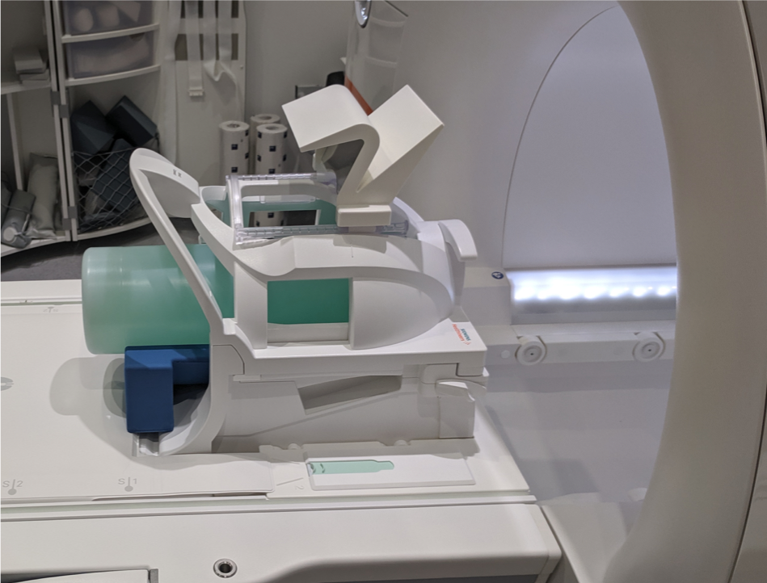
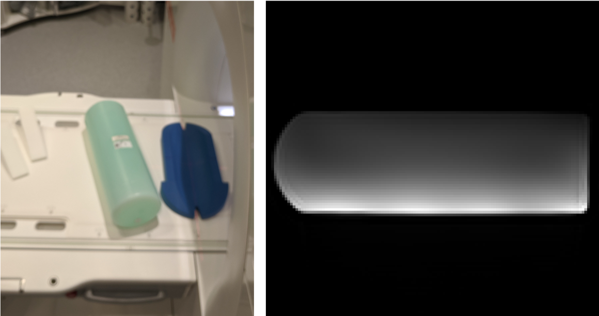
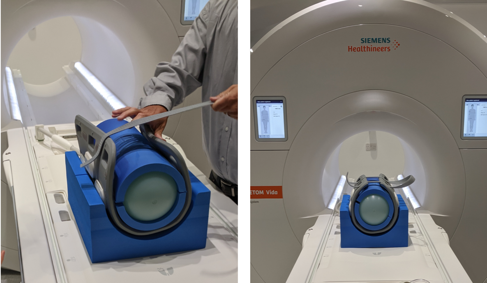
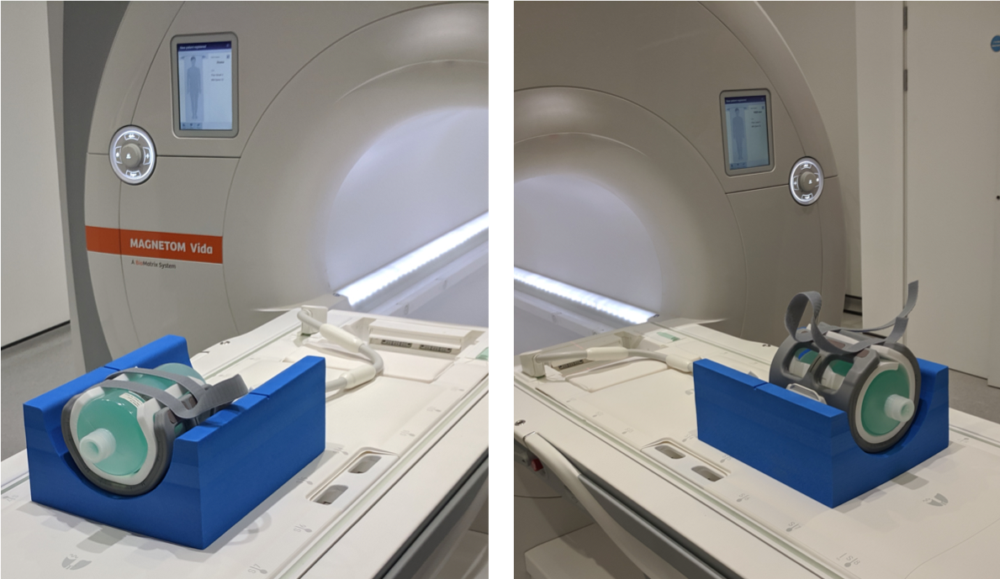
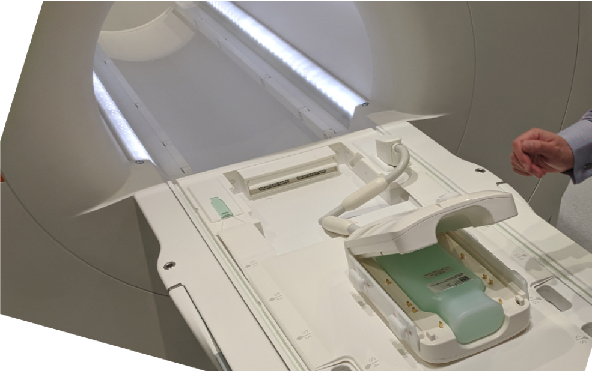
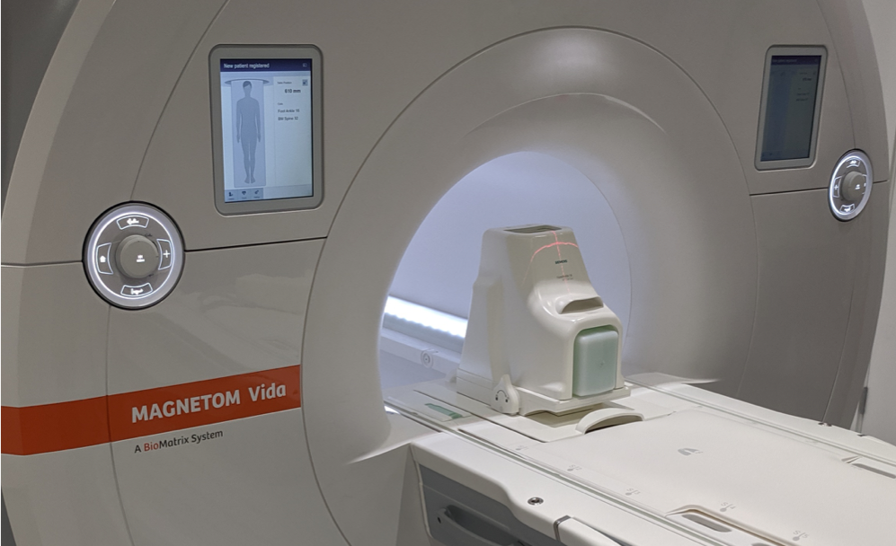

## DQA tests: Positioning of phantoms
# UCLH Royal ENT Eastman Dental Hospital (Siemens MAGNETOM VIDA)

  

## Head & Neck 64 coil:
Please test both Head and Neck elements **separately**.  
You can select *'go to isocentre'* in the *'routine'* tab, to ensure the different images are acquired with the FOV in the centre of the scanner.

 

   

  

## Spine coil elements:
  
Place a flat foam holder on top of the spine element and use the laser guide to align the foam perpendicular to the field. Then place the long mineral oil bottle on the foam, as centred as possible.  
Acquire *transverse* slices with Right-to-Left readout direction and half the matrix size along the Anterior-Posterior (phase encoding) direction, e.g 256x218 (or as low as 128x64 to save time).

Parameters used in previous test:
* TR: 1000 ms
* TE: 30 ms
* Pixel BW: 130 Hz
* FOV: 450mm Read with 50% PE
* Resolution: 128x64
* Pixel dim: 3.5 x 3.5 x 5 mm 
* SliceWidth: 5mm

  
*Use the laser guide to align the foam with spine element and then place the phantom on top. Image the entire bottle volume with transverse orientation slices.*

   

## Body 18 coils:
 

  

## Body-Flex coils:
 

  

## Tx/Rx Knee coil:
 

  

## Hand & Wrist coil:
 

  

## Foot and Ankle coil:
 
