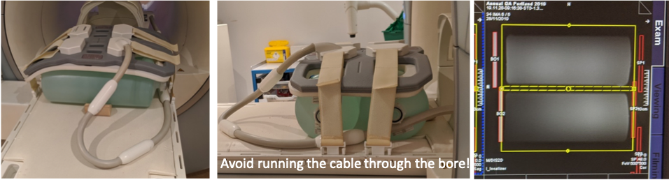
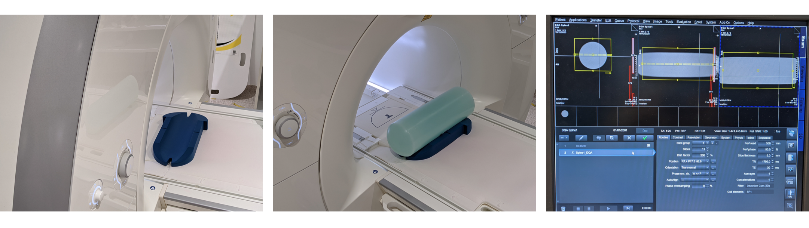

## DQA tests: Positioning of phantoms
# UCLH Radiology - MR2 (Siemens Avanto) 

  

## Head & Neck coil:
Using foam support, place the bottle phantom inside the head coil until it touches it.
 

## Torso, Torso XL and Cardiac coils:
Place the bottle phantom parallel to each other along the xy axis on the scanner table. Lightly wrap the phantoms with the coils on top. Make sure the centre of the coil is between the 2 bottles and the centre of the coil goes to the isocentre of the scanner (as shown below).   
Make sure only the coil of interest is selected before starting the acquisition.

 

## Breast coils
Place the breast phantoms (or 2 mineral oil bottles) standing inside the coil.   
Ensure the breast coil is selected before starting the acquisition.
 

## Spine coils
Place the long support foam on top of the spine-coil element to be tested and make sure it propeperly centred and align using the positioning laser of the scanner. Place the the bottle phantom centred on top of the foam.   
Ensure the breast coil is selected before starting the acquisition.
 
