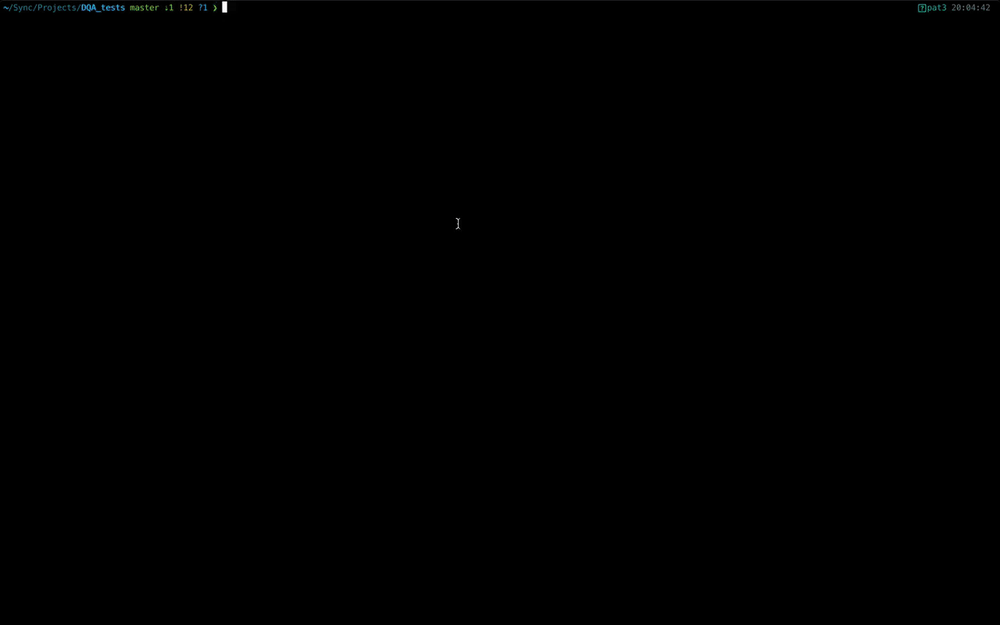

# About

The [Daily Quality Assurance (DQA) tests](dqa.md) provide a quick diagnostic tool to monitor the performance of MR coils over their service life.   

This repository gives instructions on how to install and use the script provided to process data from the DQA tests performed on MR coils at UCLH.  

# Installation
The script needs [Python 3](https://www.python.org/downloads/)  and [dcm2niix](https://github.com/rordenlab/dcm2niix)  software to work.  
* To check if you have the required versions of Python and dcm2niix  installed, in a terminal run:    
`python3 -V`   (Python version should  be <t>&ge;</t> 3.7)  
`dcm2niix -u` (dcm2niix version needs to be <t>&ge;</t> v1.0.20200331)

###  Python 3:
Download [Python 3](https://www.python.org/downloads/) from the official website and follow the installation instructions.

### dcm2nix:
To install the latest vesrion of dcm2niix run one of the following commands:  
* On Linux:  
`curl -fLO https://github.com/rordenlab/dcm2niix/releases/latest/download/dcm2niix_lnx.zip`
* On Mac:  
`curl -fLO https://github.com/rordenlab/dcm2niix/releases/latest/download/dcm2niix_mac.zip`
* On Windows:  
`curl -fLO https://github.com/rordenlab/dcm2niix/releases/latest/download/dcm2niix_win.zip`

For more information visit [dcm2nix](https://github.com/rordenlab/) on GitHub.

### Install script and dependencies:
* Clone or download this repository in a folder of your choosing, e.g. 'projects':  
`mkdir ~/projets`  
`cd ~/projets`  
`git clone https://github.com/papomail/Daily_QA_UCLH.git`  

* Create and activate a virtual environment for the project (recommended):  
  `cd Daily_QA_UCLH`  
  `python -m venv dqa`  
  `source dqa/bin/activate`

* Install python requirements:  
  `pip install --upgrade pip`  
  `pip install -r requirements.txt`

# How to use it

The script runs in command line taking the path to folder with the DQA data as a single argument.
Assuming the following folder structure:
  
    ├── ...
    ├── DATA              # Main folder with data from DQA tests
    │   ├── test1         # 1st test folder 
    │   │   ├── DICOMDIR
    │   │   └── DICOM 
    │   ├── test2         # 2nd test folder
    │   │   ...           
    │   └── test3         # 3rd test folder
    │       ...         
    └── ...

* To process all tests 1, 2 and 3 run:   
  `python run_DQA /DATA`  

* To process a single dataset, e.g. test3, you would run:   
  `python run_DQA /DATA/test3`

The script will automatically select the [required files](dqa.md#labeling-acquisitions) and process them. Once finished, a summary of the results will be displayed in your browser.   
A 'Results' folder will also be created inside the input folder, which will contain:
 - The converted NIFTI images.
 - PNG images showing the ROI used for the analysis.
 - The individual results of each test (as CSV files inside the corresponding folder).
 - The summary of all tests (as a CSV file).

## Troubleshooting
This is a pre-release version which may contain bugs. Please report bugs and suggest improvements in the [issues](https://github.com/papomail/Daily_QA_UCLH/issues) section on GitHub or directly by email at francisco.torreadeal@nhs.net.

## License

This software is open source covered by the MIT license. See the [license.md](license.md) file for more details.
