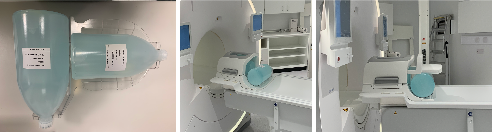
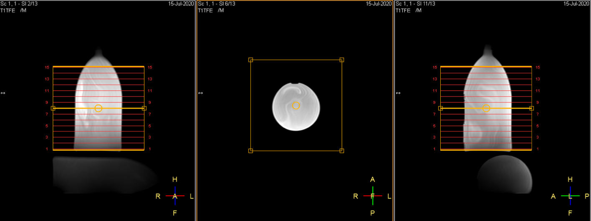
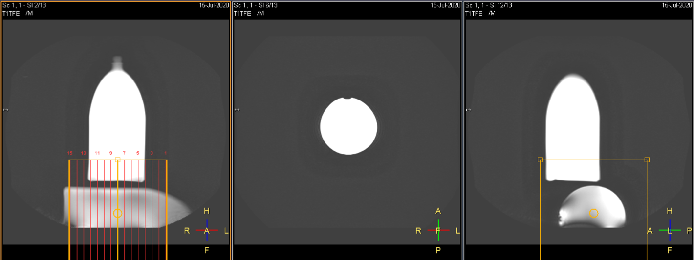
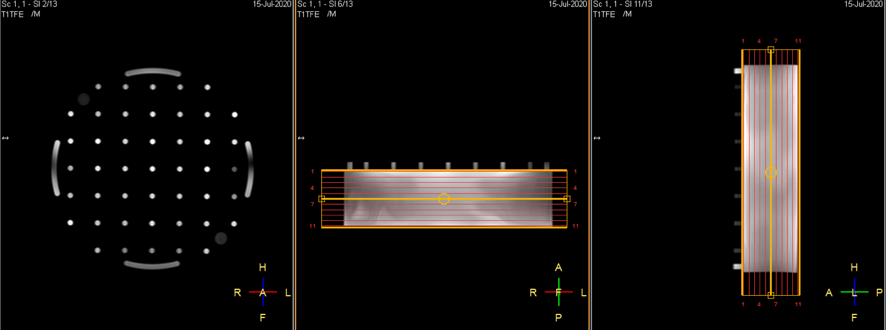

 
## DQA tests: Positioning of phantoms
# UCLH Radio Therapy (Philips Ingenia Ambition X)

  

## Head & Neck coil:
 

* Test the both *Head* and *Neck* elements separetely and plan the acquisitions so that the images from both are alike.
  
*Plan for head elements*

 *Plan for neck elements* 

  

## Flex coils:
 

  

## Anterior coil:

*Anterior coil planning*