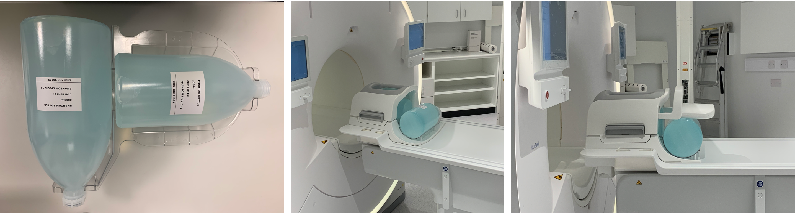
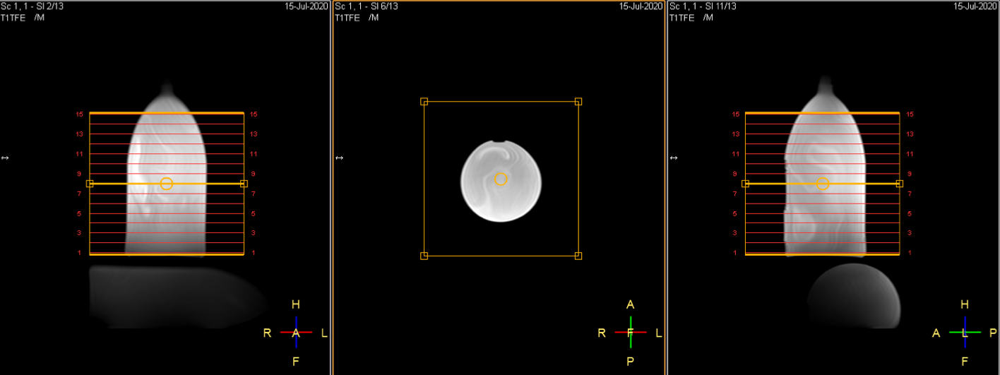
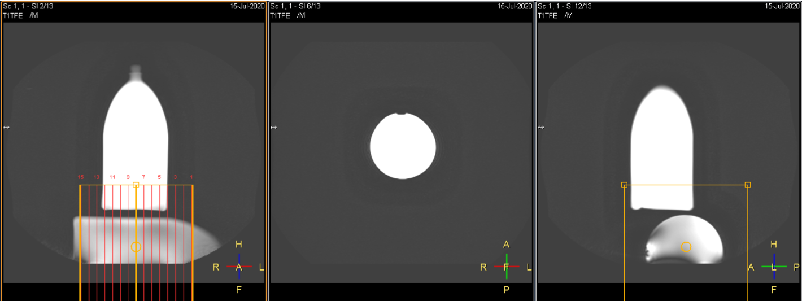
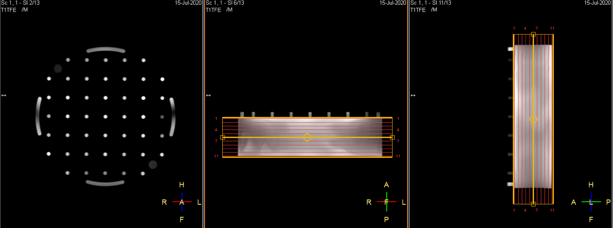

 
## DQA tests: Positioning of phantoms
# UCLH Radio Therapy (Philips Ingenia Ambition X)

  

## Head & Neck coil:
 

* Test the *Head* and *Neck* elements separately and change the scan orientation so that the images from both elements are alike:
  

*Transverse orientation for the head elements*

*Sagittal orientation for tne neck elements*
 
  

## Flex coils:
 

  

## Anterior coil:

*Anterior coil planning*
