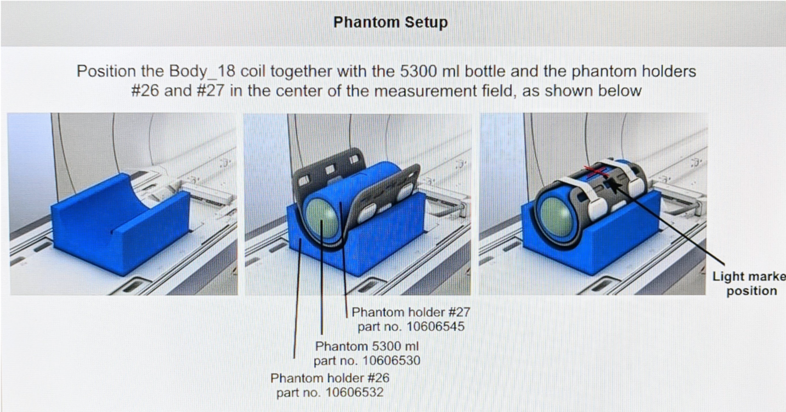
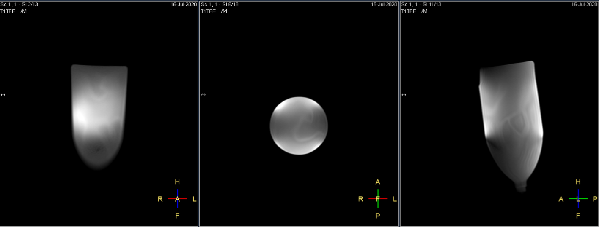
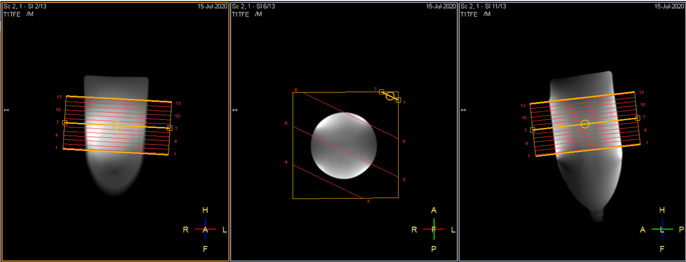

# Running a Daily QA Test

The purpose of the DQA tests is to acquire data from MR coils on a regular basis to monitor their performance and alert of potential issues ahead of time. These tests are meant to be short and easy to reproduce so that they can be run with minimal impact to the daily workload.

*A single time-point measurement is useless out of context, please run the DQA tests regularly*.
## Acquisition

The DQA tests are based on the acquisition of a simple volumetric SpinEcho data with **2 dynamics** (repetitions).  
But bare in mind that for the DQA tests to be effective they have to be: 
* Consistent
    * Always use the same test phantoms 
    * Use the same scan parameters for consecutive tests, e.g.:   
TR  = 1000 ms   
TE = 30 ms   
BW = 130 Hz/Pix  
Image Filters: **off**   
Distortion Correction: on 
*	Quick&Easy to run (~5min)
    * Use small a Matrix Size (<t>&le;</t>256x256)
    * Use a TSE multi-slice sequence to keep the scan time under control but keep a short echo-train length (e.g. ETL=3).
*	Cover a wide sensitive volume 
    * e.g. for the spine elements the FOV covers the entire bottle-phantom volume, with multiple 5mm thick slices.

## Positioning the test phantoms
The test phantoms, which would normally be provided by the manufacturer (standard mineral oil bottles or more specific phantoms for dedicated coils), should be placed in the centre of the coil's sensitive volume and scanned at the isocentre of the scanner.  

See sections below for examples on how to position the test phantoms on different systems.

* [UCLH Radio Therapy](RT.md) (Philips Ingenia Ambition X) 
* [UCLH Radiology - MR2](RT.md) (Siemens Avanto) 
* [UCLH Royal ENT Eastman Dental Hospital](ENT.md) (Siemens MAGNETOM VIDA)
 

Most manufacturers have a guide with illustrations on how to position the test phantom for their own internal QA tests. Following those same guidelines can be a good way of maintaining consistency of phantom positions in DQA tests.  
These guides can by accessed from the scanner console by selecting: 
* ***SPT*** (System Performance Test) from the ***System*** menu (in Philips systems). 
* ***Options > Service > Customer QA*** (in Siemens systems).

It is worth pointing out that it is **only the positing of the phantoms** that we are interested in from these guides. Once the phantom is correctly positioned, we would close the manufacturer's test menu and carry on with our DQA test.

  

*Example illustration from Siemens' Customer QA guide.*

## Labeling the acquisitions
In order to automatically identify the DICOM files with the corresponding DQA datasets, the scans should be labelled using this *'Coil_Name_DQA'* pattern. Here are a few examples:
- When testing the head element of a Head&Neck coil label the acquisition as:    **HN_Head_DQA...** 
- For the anterior part of a BodyMatrix coil: **BM_Anterior_DQA...**
- For a Large FlexCoil: **Flex_L_DQA...**

The data processing scrip will use the text *before* '_DQA' as the coil name. (You can add any descriptive comment after '_DQA' for the acquisition, but it wont be used as the coil name in the code). 
 

##  Good practices for best results

 
*Visible flow patterns due to liquid moving inside the phantom. Wait a bit longer before starting the acquisition.* 

 

*The liquid has now stopped moving and you are ready to scan.*

 

* Every time a phantom is positioned, **wait 2 minutes before starting the acquisition** to allow the fluid inside the phantom to stop moving.  
* Allow **10s recovery between the dynamic scans**.  
* Check that the **correct coil elements** are selected (if necessary unclick *smart coil selection*).  
* Run the scans with **no parallel imaging** (no SENSE or GRAPPA).
* When testing similar coils (e.g. multiple flex coils, anterior, posterior elements) make sure to give each coil its own **unique tag**.   
* Export the data as ‘Single Frame’ DICOMS.
* **Save the protocol** so it is easy to reproduce.

